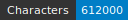
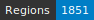
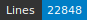
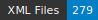

# cremma-medieval

    

*This project was funded by the DIM MAP in the context of the CREMMA project (https://www.dim-map.fr/projets-soutenus/cremma/)*

The cremma-medieval repository was created in order to make available transcription corpora for training HTR models for medieval manuscripts from the 12th to the 15th century.

The CREMMA Medieval dataset has been built with eScriptorium (http://traces6.paris.inria.fr), an interface for HTR ground truth production, and, Kraken, an HTR and layout segmentation engine. It is composed of fifteen Old French manuscripts written between the 13th and 15th centuries, mainly scanned in high definition and color except for one manuscript (Vatican) which is a black and white document and BnF fr. 17229, 13496 and 411 that come from microfilm scans. The datasets is mostly made from pre-existing transcribed texts and the samples size can be very different from one source manuscript to the other. The basis of the dataset is composed of the following transcriptions : 

*  Bibliothèqe nationale de France, Arsenal 3516, Crowdsourced transcriptions of the collaborative projects of the Standford Library: Bestiaire de Guillaume le Clerc de Normandie (https://fromthepage.com/stanfordlibraries/guillaume-le-clerc-de-normandie-s-bestiary)
*  Bibliothèqe nationale de France, fr. 411, *Vie de saint Lambert*  transcribed by A. Pinche (ENC) 
*  Bibliothèqe nationale de France, fr. 412, *Li Seint Confessor* de Wauchier de Denain transcribed by A. Pinche (ENC) 
*  Bibliothèqe nationale de France, fr. 844, *Manuscrit du Roi*, Maritem project(https://anr.fr/Projet-ANR-18-CE27-0016) transcribed by V. Mariotti (projet Maritem)
*  Bibliothèqe nationale de France, fr. 1728, *Le Livre de l'enseignement des roys et des princes*, transcribe by Noé Leroy (Projet Gallic(orpor)a)
*  Bibliothèqe nationale de France, fr. 13496, *Vie de saint Jérôme* transcribed by A. Pinche (ENC) 
*  Bibliothèqe nationale de France, fr. 17229, *Vie de saint Jérôme* transcribed by A. Pinche (ENC) 
*  Bibliothèqe nationale de France, fr. 25516, *Beuve de Hantone* transcribed By A. Nolibois (Université d'Aix-Marseille)
*  Bibliothèqe nationale de France, fr.22550, *Les Sept Sages de Thèbes*, this project just started in Geneva under the direction of Y. Foehr-Janssen (UNIGE), the different have been transcribed by Camille Carnaille (ULB/UNIGE) (fol.157r, 163v, 174v, 178v, 186v, 200v), Prunelle Deleville (UNIGE) (fol. 157v, 178r, 186r, 200r, 204r, 343v), Sophie Lecomte (ULB) (fol. 174v), Aminoel Meylan (UNIGE) (169r), Simone Ventura (ULB) (fol. 163r). 
* Cologny, Bodmer, 168 and Vatican, Reg. Lat., 1616, *Chanson d'Otinel* transcribed by J. -B. Camps (ENC)  from the Geste project (https://github.com/Jean-Baptiste-Camps/Geste)
* University of pennsylvania, codex 660, pelerinage de mademoiselle Sapience, transcribed by Ariane Pinche (ENC) 
* University of pennsylvania, codex 909, *Énéide*, transcribed by Lucien Dugaz (ENC)

As the data come from different projects, transcriptions have been standardized to strengthen HTR models. We chose a graphemic transcription method, following D. Stutzmann definitions (see bibliography), to have a sign in the image corresponding to a sign in our text: all the abbreviations are kept, and u/v or i/j are not distinguished. The spaces in the dataset are not homogeneously represented, sometimes transcriptions reproduce the manuscript spacing while others use lexical spaces. It must be stressed that spaces are the most important source of error in medieval HTR models. Most of the transcription follow the layout segmentation of the SegmOnto ontology (https://github.com/SegmOnto/examples), separating the main column, margin, numbering, drop capital, etc. 

To ensure the quality of the data, continuous integration workflow (Github Actions) has been put in place checking the segmentation vocabulary (Segmento): XML schema validator (segmentoAltoValidator.xsd), but also the homogeneity of the signs of the characters used in the dataset through a list of authorized signs and translation table (table.csv) with ChocoMufin.

We use releases to make available our HTR models, trained with Kraken, for medieval manuscripts :

- 0.0.1 Arabica, accuracy 89,19% (21/06/21)
- 1.0.0 Bicerin, accuracy 95,49% (21/07/13)
- 1.1.0 Bicerin, accuracy 95,30% (22/06/20)

*Table summarizing the corpus (state 22/07/01)*

 Manuscript                            | Date | Transcribed Lines |
|:---------------------------------------|:------|-------------------:|
| BnF, ms fr. 412                       | 13th | 6324              |
| BnF, Arsenal 3516                     | 13th | 1991              |
| Cologny, bodmer, 168                  | 13th | 1976              |
| BnF, ms fr. 24428                     | 13th | 1328              |
| BnF, ms fr. 25516                     | 13th | 717               |
| BnF, ms fr. 844                       | 13th | 224               |
| BnF, ms fr. 17229                     | 13th | 164               |
| BnF, ms fr. 13496                     | 13th | 161               |
| BnF, Arsenal 3516                     | 13th | 105               |
| BnF, ms fr. 22549                     | 14th | 2682              |
| Vaticane, Reg. Lat., 1616             | 14th | 1772              |
| University of pennsylvania, codex 660 | 14th | 368               |
| BnF, ms fr. 411                       | 14th | 179               |
| BnF, ms fr. 1728                       | 14th |622           |
| University of pennsylvania, codex 909 | 15th | 2513              |
| All                                   |      | 22278            |

If you want to transcribe texts according to our recommendations, you can load the *CremmaLab.json* keyboard in the Escriptorium interface. In order to ensure the correct display of the characters, in the FireFox browser, install Stylus plugin (https://addons.mozilla.org/fr/firefox/addon/styl-us/), then the customisation: MUFI for eScriptorium (https://userstyles.world/style/3915/mufi-for-escriptorium).

**Bibliography** 

J.-B. Camps, La Chanson d’Otinel : édition complète du corpus manuscrit
et prolégomènes à l’édition critique – digital appendices, Ph.D. thesis, 2017. URL: https://zenodo.org/record/1116736#.XN1ufC3M00Q. doi:10.5281/zenodo. 1116736.

J.-B. Camps, T. Clérice, A. Pinche, Stylometry for Noisy Medieval Data: Evaluating Paul Meyer’s Hagiographic Hypothesis, arXiv:2012.03845). URL: http: //arxiv.org/abs/2012.03845, arXiv: 2012.03845.

J.-B. Camps, C. Vidal-Gorène, M. Vernet, Handling Heavily Abbreviated Manuscripts: HTR engines vs text normalisation approaches, 2021. URL: https: //hal-enc.archives-ouvertes.fr/hal-03279602.

T. Clérice, Evaluating Deep Learning Methods for Word Segmentation of Scripta Continua Texts in Old French and Latin, 2019. URL: https://hal.archives-ouvertes. fr/hal-02154122, working paper or preprint.

B. Kiessling, R. Tissot, P. Stokes, D. S. B. Ezra, eScriptorium: An Open Source Platform for Historical Document Analysis, in: 2019 International Conference on
Document Analysis and Recognition Workshops (ICDARW), volume 2, 2019, pp.
19–19. doi:10.1109/ICDARW.2019.10032.

A. Pinche, Edition nativement numérique du recueil hagiographique "Li Seint Confessor" de Wauchier de Denain d’après le manuscrit 412 de la Bibliothèque nationale de France, Thèse de doctorat, Lyon, Lyon, 2021. URL: http://www.theses.
fr/s150996.

D. Stuzmann, Paléographie statistique pour décrire, identifier, dater. . . normaliser pour coopérer et aller plus loin ?, in: F. Fischer, C. Fritze, G. Vogeler (Eds.), Kodikologie und Paläographie im digitalen Zeitalter 2 - Codicology and Palaeography in the Digital Age 2, volume 3, Books on Demand (BoD), Norderstedt, 2011, pp. 247–277. URL: https://kups.ub.uni-koeln.de/4353/.

